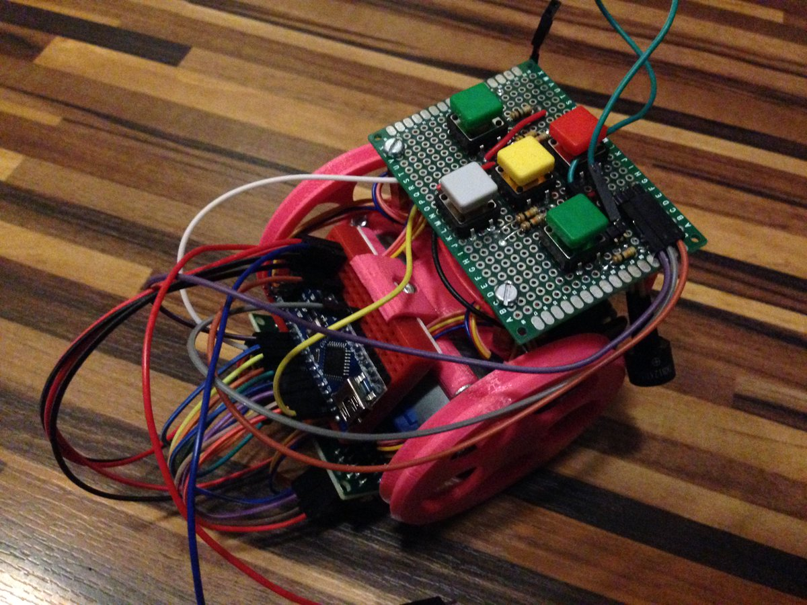
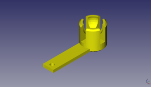
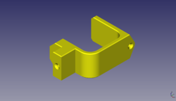
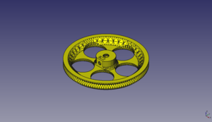

# Escornabot DIY
Material recopilado del GitHub de [Xoan Sampaiño](https://github.com/xoan) y [Rafa Couto](https://github.com/rafacouto)
Modelo escornabot DIY basado en https://github.com/escornabot/3dmodel  
  
  

  
  
  
# Piezas Impresas3D Necesarias
  
Descripción         | imagen          | archivo         
------------- | ------------- | ------------- 
Sujeción bola trasera| | [BallCaster.stl](archivos-stl/BallCaster.stl) 
Sujeción batería| | [BatteryBracket.stl](archivos-stl/BatteryBracket.stl) 
Sujeción motores| | [MotorBracket.stl](archivos-stl/MotorBracket.stl) 
Rueda x2| | [WheelNG.stl](archivos-stl/WheelNG.stl) 
Sujeción rotoboard 170 puntos| | [Addon-EscornaCPUBracket.stl](archivos-stl/Addon-EscornaCPUBracket.stl)
Sujeción placa botonera| | [Addon-KeypadBracket-PCB.stl](archivos-stl/Addon-KeypadBracket-PCB.stl)
  
  
  
### Opcional
  
En mi caso no monto la pieza sujeción interruptor. Dejo los cables para conectar macho con hembra para enseñar a los peques la conexión de los cables.

Descripción         | Imagen          | Archivo          
------------- | ------------- | ------------- 
Sujeción interruptor| | [Addon-SwitchHolder.stl](archivos-stl/Addon-SwitchHolder.stl)
  
  
  
### Diseños de piezas nuevos
  
Algunas piezas van evolucionando, te dejo las versiones nuevas de las ruedas o la sujeción de la bola.

Descripción         | Imagen          | Archivo          
------------- | ------------- | ------------- 
Sujeción bola v2| | [ballcaster-v2.stl](archivos-stl/ballcaster-v2.stl) 
Rueda izquierda| | [wheel-l.stl](archivos-stl/wheel-l.stl) 
Rueda derecha| | [wheel-R.stl](archivos-stl/wheel-R.stl) 
  
  
  
# Guías y manuales
  
Guía de montaje del CFR Ferrol, es en la que me basé yo para montar mi primer escornabot. Tienes instrucciones para montar la botonera - [Guía montaje CFR Ferrol](https://www.edu.xunta.gal/centros/cfrferrol/aulavirtual2/pluginfile.php/18631/mod_resource/content/0/doc/Proxecto_K-KuriBOT_CFR_FERROL.pdf)

Listado de materiales necesarios para montar tu escornabot, es de la web original y tienes todos los componentes que te haran falta para poner al pequeñajo a caminar - [Listado materiales](http://escornabot.org/wiki/index.php/Lista_de_materiales_(Brivoi))

Guía de montaje sin incluir ensamblaje de botonera, de la web original del proyecto escornabot - [Guía montaje](http://escornabot.org/wiki/index.php/Gu%C3%ADa_de_montaje_(Brivoi))

Como comprobar la lectura de la botonera para luego modificar los valores en el archivo configuration.h - [Comprobación botonera](https://escornabot.com/web/es/content/comprobacion-y-configuracion-de-las-lecturas-de-botonera)

Diferentes versiones de  realizadas hasta ahora [Versiones arduino para escornabot](https://github.com/escornabot/arduino/releases) 
