# AVISO!! En construcción, estos días retocaré muchas cosas aunque lo esencial siempre lo tendrás a mano :P
  
# Escornabot DIY  
  
Material recopilado de [Xoan Sampaiño](https://github.com/xoan), [Rafa Couto](https://github.com/rafacouto), [XDeSIG](https://github.com/xdesig), [Jorge Lobo Martínez](https://github.com/lobotic) y [mgesteiro](https://github.com/mgesteiro)   
  
Web oficial del robot escornabot http://escornabot.com

Vamos a describir uno tras otros todos los pasos a seguir para montar la versión DIY (la de los cablecicos)
  
  
  
# 1. Piezas Impresas3D Necesarias
  
Descripción         | imagen          | archivo         
------------- | ------------- | ------------- 
Sujeción bola v2|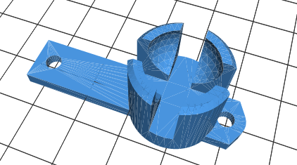 | [ballcaster-v2.stl](archivos-stl/ballcaster-v2.stl)  
Sujeción batería|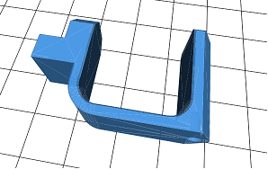 | [battery-bracket.stl](archivos-stl/battery-bracket.stl)  
Sujeción motores|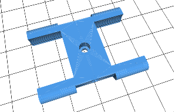 | [MotorBracket.stl](archivos-stl/MotorBracket.stl)  
Sujeción protoboard 170 puntos|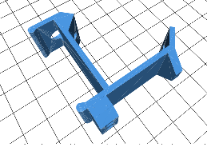 | [board-bracket.stl](archivos-stl/board-bracket.stl)  
Sujeción placa botonera|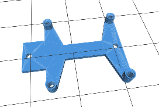 | [Addon-KeypadBracket-PCB.stl](archivos-stl/Addon-KeypadBracket-PCB.stl)  
Rueda izquierda|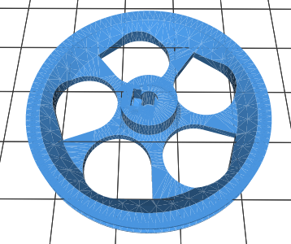 | [wheel-l.stl](archivos-stl/wheel-l.stl)  
Rueda derecha|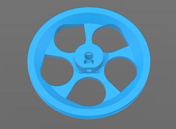 | [wheel-r.stl](archivos-stl/wheel-r.stl)  
  
  
### 1.1 Opcional
  
En mi caso, no monto la pieza "sujeción interruptor". Dejo los cables para conectar macho con hembra y enseñar a los peques la conexión de los cables.

Descripción         | Imagen          | Archivo          
------------- | ------------- | ------------- 
Sujeción interruptor|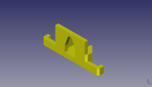 | [Addon-SwitchHolder.stl](archivos-stl/Addon-SwitchHolder.stl)
  
  
  
# 2. Componentes Electrónicos
  
## 2.1. Placa Botonera 

Es la parte más problemática y tienes dos opciones:
  
  
### 2.1.1. Placa original totalmente artesanal

Tienes todos los detalles en la web del proyecto [pincha aquí](https://escornabot.com/web/es/content/botonera-audaciuso) 

También la tienes documentada en la  [guía del CFR Ferrol](https://www.edu.xunta.gal/centros/cfrferrol/aulavirtual2/pluginfile.php/18631/mod_resource/content/0/doc/Proxecto_K-KuriBOT_CFR_FERROL.pdf)
  
  
### 2.1.2. Versión de [XDeSIG](https://github.com/xdesig)
  

  
La puedes pedir aquí - [Placa XDeSIG en PCBWay](https://www.pcbway.com/project/shareproject/W50475ASN5_Escorna_bot_2_1_Gerber.html)

Estos son los materiales que necesitas soldar en la placa:

- 5 resistencias 10k
- 1 resistencia 22k
- Pines acodados
- 5 botones 12mm (también puedes poner los pequeños)
  
  
### Para esta placa necesitas imprimir una sujeción concreta
  
También tiene carcasa :)
  
Descripción         | Imagen          | Archivo          
------------- | ------------- | ------------- 
Sujeción placa botonera XDeSIG|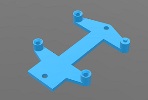 | [Addon-KeypadBracket-5Buttons.stl](archivos-stl/Addon-KeypadBracket-5Buttons.stl)
Cubierta botonera XDeSIG|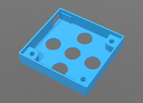 | [Addon-KeypadCover.stl](archivos-stl/Addon-KeypadCover.stl)
Botones XDeSIG|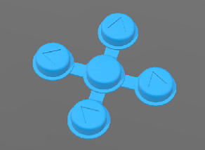 | [Addon-KeypadButtons-Graphics.stl](archivos-stl/Addon-KeypadButtons-Graphics.stl)
  
__*Recuerda, una vez montada tienes que [comprobar y configurar las lecturas de la botonera](https://escornabot.com/web/es/content/comprobacion-y-configuracion-de-las-lecturas-de-botonera)__
  
  
## 2.2. Componentes del cuerpo 

2 – Motores paso a paso **28BY J-48** con “placa” **drive ULN2003**  
2 – Juntas tóricas de **63x60x3** (para las ruedas)  
1 – **Arduino Nano Atmega328** (También puedes usar un Arduino Pro-Mini)  
1 – Zumbador o **Buzzer de 5V**  
1 – **Protoboard** pequeña de **170 puntos**  
1 – **Portapilas** de cuatro unidades para **pilas AA** (no confundir con las AAA que son las finitas)  
20 – Cables arduino macho-hembra (te van a sobrar pero más vale prevenir)  
2 – Cables arduino macho-macho (para la conexión pilas-protoboard)  
16 – Tornillos M3 (a mi me gustan con la punta para destornillador de estrella)  
2 – Tuercas M3 (para las ruedas)  
1 – **Canica de 14mm** (si te gustan las de la carita, busca “bola 14mm smile”)  
  
Si eres curios@ y quieres comprarlos por tu cuenta estoy creando una [lista de componentes](https://github.com/pablorubma/escornabot-DIY/tree/master/componentes)
  
  
# 3. Montaje del cuerpo

Puedes consultar la [guía de montaje en la página oficial](https://escornabot.org/wiki/index.php/Gu%C3%ADa_de_montaje_(Brivoi)).

También te sirve de ayuda si montas la [versión Ogaki de abiertocc](https://abierto.cc/shop/#search=ogaki) o la [versión v2.12](https://twitter.com/i/moments/924502947236601856)  
  
  
  
# 4. Cableado de los drivers, buzzer y portapilas

Ya tenemos todo colocado en su sitio, ahora hay que conectar los diferentes componentes con Arduino NANO. Para eso puedes seguir la [guía de cableado](https://escornabot.com/web/es/content/cableado)
  
  
  
# 5. Instalación IDE Arduino y descarga de la programación

Si es la primera vez que utilizas Arduino lo mejor es consultar directamente en la web, [instalar el software (IDE) de arduino](https://www.arduino.cc/en/Guide/Windows)

Las diferentes programaciones las puedes encontrar en el [repositorio de Rafa Couto en GitHub](https://github.com/escornabot/arduino/releases/tag/v1.4.1)

Algunas cosas importantes que debes seleccionar antes de compilar y cargar la programación en tu arduino NANO:

* Selecciona la **placa Arduino NANO** (o la que uses)
* El **procesador** que usa (si es el 164 o 328)
* **Puerto COM del PC** al que lo tienes conectado
  
  
  
# 6. Comprobación de la botonera

Ya lo he comentado antes, pero **este paso se suele olvidar** y **es uno de los que más quebraderos de cabeza causa**. Yo hago la comprobación una vez montado el robot entero, pero tu puedes hacerlo cuando quieras.

[Comprobación y configuración de las lecturas de la botonera](https://escornabot.com/web/es/content/comprobacion-y-configuracion-de-las-lecturas-de-botonera)

Anota los valores de cada botón para editarlos en el archivo **configuration.h**
  
  
  
# 7. A jugar

Si todo ha ido bien, el pequeñajo tiene que empezar a caminar. Cuando te familiarices un poco con Arduino puedes probar a tocar la programación, cambiar los giros, la velocidad, los sonidos del buzzer, añadir sensores, ponerle bluethoot, wifi y todo lo que se te ocurra.

A continuación tienes unos recursos extra :)
  
  
  
# Bluetooth y manejo mediante app android [Jorge Lobo Martínez](https://github.com/lobotic)
  
Puedes ponerle Bluetooth a tu escornabot. Solo necesitas leer el artículo de Jorge en su blog https://ceipmiskatonic.blogspot.com.es/2015/07/usando-el-escornabot-por-bt.html
  
  
  
  
# MUWI uso mediante Wifi con módulo ESP-01 [mgesteiro](https://github.com/mgesteiro) 
  
Con la placa escornabot v 2.12 va muy bien, con la versión DIY todavía no he probado.

De todos modos, os dejo el enlace al repositorio de Miguel donde podeis encontrar toda la información para que lo tengáis a mano. https://github.com/escornabot/esp-muwi
  
  
  
# Guías y manuales
  
Guía de montaje del CFR Ferrol, es en la que me basé para montar mi primer escornabot. Tienes instrucciones detalladas para montar la botonera - [Guía montaje CFR Ferrol](https://www.edu.xunta.gal/centros/cfrferrol/aulavirtual2/pluginfile.php/18631/mod_resource/content/0/doc/Proxecto_K-KuriBOT_CFR_FERROL.pdf)

Listado completo de materiales necesarios, web original escornabot. Todos los componentes que te haran falta para poner al pequeñajo a caminar - [Listado materiales](http://escornabot.org/wiki/index.php/Lista_de_materiales_(Brivoi))

Guía de montaje sin incluir ensamblaje de botonera, web original escornabot - [Guía montaje](http://escornabot.org/wiki/index.php/Gu%C3%ADa_de_montaje_(Brivoi))

Como comprobar la lectura de la botonera para luego modificar los valores en el archivo "configuration.h" - [Comprobación botonera](https://escornabot.com/web/es/content/comprobacion-y-configuracion-de-las-lecturas-de-botonera)

Diferentes versiones de  realizadas hasta ahora [Versiones arduino para escornabot](https://github.com/escornabot/arduino/releases)  
  
  
  
# Recursos y materiales

En la wiki del proyecto oficial tienes un apartado dedicado a recursos donde puedes encontrar actividades o tableros para escornabot [Recursos Wiki Oficial](http://escornabot.org/wiki/index.php/Recursos)
  
Un imprescindible es el Blog de [Jorge Lobo Martínez](https://github.com/lobotic), donde comparte las actividades que hace en clase. Te dejo enlace a la sección donde trata cosas de escornabot pero revisa el blog completo porque mola mucho - [Blog Lobotic](http://ceipmiskatonic.blogspot.com.es/search/label/Escornabot)
  
Puedes disfrazar a tu pequeñajo [Disfraz Escornabot](https://github.com/pablorubma/escornabot-DIY/tree/master/disfraces)
  
  
  
# Para solucionar dudas y problemas

Si tienes cualquier duda puedes abrir un tema en el grupo creado en google y entre todos te ayudaremos :)
https://groups.google.com/forum/#!forum/escornabot_users
  
  
  
## Bienvenid@ al lado escornabot de la fuerza muahahaha  
