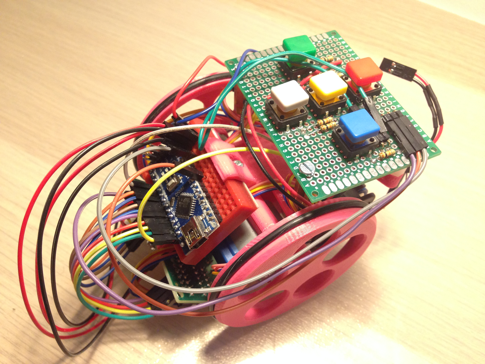

# AVISO!! En construcción, estos días retocaré muchas cosas aunque lo esencial siempre lo tendrás a mano :P
  
# Escornabot DIY  
  
Material recopilado de [Xoan Sampaiño](https://github.com/xoan), [Rafa Couto](https://github.com/rafacouto), [XDeSIG](https://github.com/xdesig), [Jorge Lobo Martínez](https://github.com/lobotic) y [mgesteiro](https://github.com/mgesteiro)   
  
Web oficial del robot escornabot http://escornabot.com
  
  

  
  
  
# Piezas Impresas3D Necesarias
  
Descripción         | imagen          | archivo         
------------- | ------------- | ------------- 
Sujeción bola v2| | [ballcaster-v2.stl](archivos-stl/ballcaster-v2.stl)  
Sujeción batería| | [battery-bracket.stl](archivos-stl/battery-bracket.stl)  
Sujeción motores| | [MotorBracket.stl](archivos-stl/MotorBracket.stl)  
Sujeción protoboard 170 puntos| | [board-bracket.stl](archivos-stl/board-bracket.stl)  
Sujeción placa botonera| | [Addon-KeypadBracket-PCB.stl](archivos-stl/Addon-KeypadBracket-PCB.stl)  
Rueda izquierda| | [wheel-l.stl](archivos-stl/wheel-l.stl)  
Rueda derecha| | [wheel-r.stl](archivos-stl/wheel-r.stl)  
  
  
### Opcional
  
En mi caso, no monto la pieza "sujeción interruptor". Dejo los cables para conectar macho con hembra y enseñar a los peques la conexión de los cables.

Descripción         | Imagen          | Archivo          
------------- | ------------- | ------------- 
Sujeción interruptor| | [Addon-SwitchHolder.stl](archivos-stl/Addon-SwitchHolder.stl)
  
  
  
### Diseños de piezas antiguas
  
Algunas piezas van evolucionando, te dejo las versiones viejas para que las tengas a mano

Descripción         | Imagen          | Archivo          
------------- | ------------- | ------------- 
Sujeción bola trasera| | [BallCaster.stl](archivos-stl/BallCaster.stl)
Rueda x2| | [WheelNG.stl](archivos-stl/WheelNG.stl) 
  
  
  
# Placa Botonera [XDeSIG](https://github.com/xdesig)
  
La parte más problemática es la botonera. Eso se soluciona con la PCB diseñada por [XDeSIG](https://github.com/xdesig)

  
La puedes pedir aquí - [Placa XDeSIG en PCBWay](https://www.pcbway.com/project/shareproject/W50475ASN5_Escorna_bot_2_1_Gerber.html)

Estos son los materiales que necesitas soldar en la placa:

- 5 resistencias 10k
- 1 resistencia 22k
- Pines acodados
- 5 botones 12mm (también puedes poner los pequeños)
  
### Para esta placa necesitas imprimir esta sujeción de placa
  
Puedes ponerle carcasa :)
  
Descripción         | Imagen          | Archivo          
------------- | ------------- | ------------- 
Sujeción placa botonera XDeSIG| | [Addon-KeypadBracket-5Buttons.stl](archivos-stl/Addon-KeypadBracket-5Buttons.stl)
Cubierta botonera XDeSIG| | [Addon-KeypadCover.stl](archivos-stl/Addon-KeypadCover.stl)
Botones XDeSIG| | [Addon-KeypadButtons-Graphics.stl](archivos-stl/Addon-KeypadButtons-Graphics.stl)
  
  
  
# Bluetooth y manejo mediante app android [Jorge Lobo Martínez](https://github.com/lobotic)
  
Puedes ponerle Bluetooth a tu escornabot. Solo necesitas leer el artículo de Jorge en su blog https://ceipmiskatonic.blogspot.com.es/2015/07/usando-el-escornabot-por-bt.html
  
  
  
# MUWI uso mediante Wifi con módulo ESP-01 [mgesteiro](https://github.com/mgesteiro) 
  
Solo he probado MUWI con la versión escornabot que lleva la placa v 2.12, no lo he probado con la versión DIY.

De todos modos, os dejo el enlace al repositorio de Miguel donde podeis encontrar toda la información para que lo tengáis a mano.
https://github.com/mgesteiro/escornabot-MUWi
  
  
  
# Guías y manuales
  
Guía de montaje del CFR Ferrol, es en la que me basé para montar mi primer escornabot. Tienes instrucciones detalladas para montar la botonera - [Guía montaje CFR Ferrol](https://www.edu.xunta.gal/centros/cfrferrol/aulavirtual2/pluginfile.php/18631/mod_resource/content/0/doc/Proxecto_K-KuriBOT_CFR_FERROL.pdf)

Listado completo de materiales necesarios, web original escornabot. Todos los componentes que te haran falta para poner al pequeñajo a caminar - [Listado materiales](http://escornabot.org/wiki/index.php/Lista_de_materiales_(Brivoi))

Guía de montaje sin incluir ensamblaje de botonera, web original escornabot - [Guía montaje](http://escornabot.org/wiki/index.php/Gu%C3%ADa_de_montaje_(Brivoi))

Como comprobar la lectura de la botonera para luego modificar los valores en el archivo "configuration.h" - [Comprobación botonera](https://escornabot.com/web/es/content/comprobacion-y-configuracion-de-las-lecturas-de-botonera)

Diferentes versiones de  realizadas hasta ahora [Versiones arduino para escornabot](https://github.com/escornabot/arduino/releases)  
  
  
  
# Recursos y materiales

En la wiki del proyecto oficial tienes un apartado dedicado a recursos donde puedes encontrar actividades o tableros para escornabot [Recursos Wiki Oficial](http://escornabot.org/wiki/index.php/Recursos)
  
Un imprescindible es el Blog de [Jorge Lobo Martínez](https://github.com/lobotic), donde comparte las actividades que hace en clase. Te dejo enlace a la sección donde trata cosas de escornabot pero revisa el blog completo porque mola mucho - [Blog Lobotic](http://ceipmiskatonic.blogspot.com.es/search/label/Escornabot)
  
  
  
# Para solucionar dudas y problemas

Si tienes cualquier duda puedes abrir un tema en el grupo creado en google y entre todos te ayudaremos :)
https://groups.google.com/forum/#!forum/escornabot_users
  
  
  
## Bienvenid@ al lado escornabot de la fuerza muahahaha  
