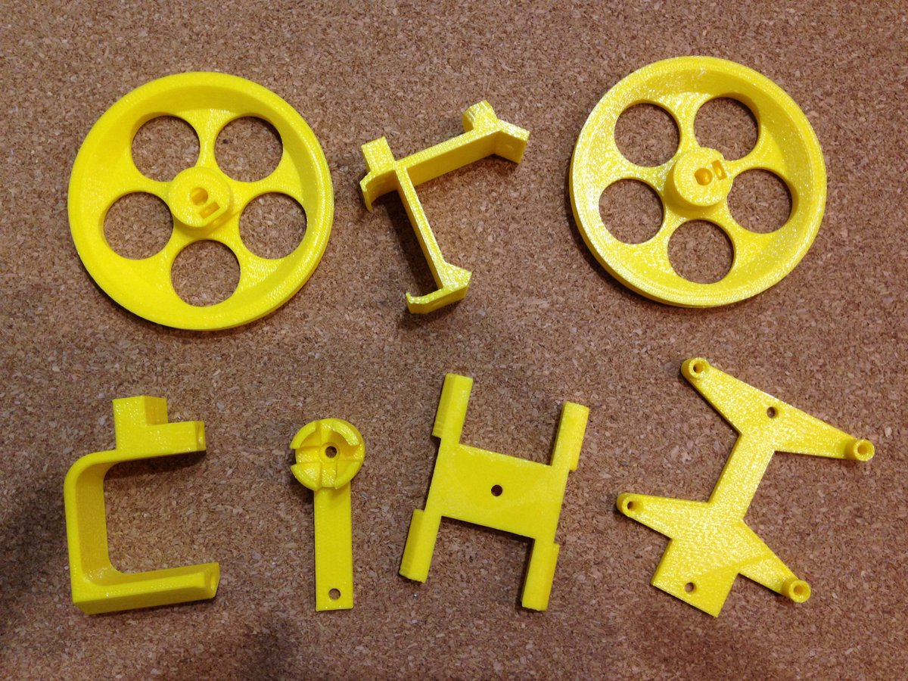

# ESCORNABOT DIY
Modelo escornabot DIY basado en https://github.com/escornabot/3dmodel

# PIEZAS IMPRESAS 3D NECESARIAS

Descripción         | imagen          | archivo         
------------- | ------------- | ------------- 
Sujeción bola trasera|!(imagenes/BallCaster.png) | [BallCaster.stl](STL/BallCaster.stl) 
Sujeción batería| | [BatteryBracket.stl](STL/BatteryBracket.stl) 
Sujeción motores| | [MotorBracket.stl](STL/MotorBracket.stl) 
Rueda x2| | [WheelNG.stl](STL/WheelNG.stl) 
Sujeción rotoboard 170 puntos| | [Addon-EscornaCPUBracket.stl](STL/Addon-EscornaCPUBracket.stl)
Sujeción placa botonera| | [Addon-KeypadBracket-PCB.stl](STL/Addon-KeypadBracket-PCB.stl)

!Opcional - En mi caso no monto esta pieza. Dejo los cables para conectar macho con hembra para enseñar a los peques la conexión de los cables.

Descripción         | Imagen          | Archivo          
------------- | ------------- | ------------- 
Sujeción interruptor| | [Addon-SwitchHolder.stl](STL/Addon-SwitchHolder.stl) 

