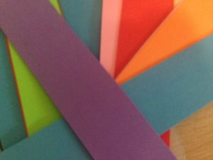
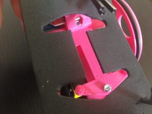
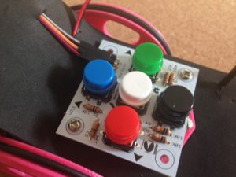
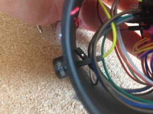
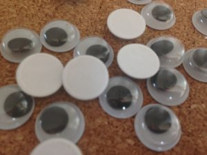
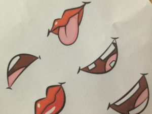
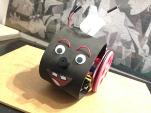
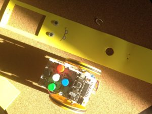
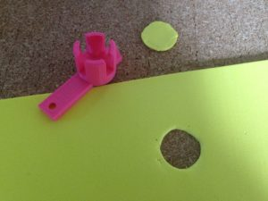
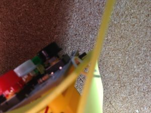

# Quiero mi disfraz!!

El origen de todo esto viene de [@mininacheshire](https://twitter.com/escornabot/status/568520109033009152) y del [blog de Lobotic](http://ceipmiskatonic.blogspot.com.es/2016/01/disfraces-para-escornabot-brivoi.html)

# Material necesario
* Goma eva
* Tijeras o cuter
* Regla
* Pegamento
* Folios
* Pinturas
* Ojos molones
* Cualquier objeto que resulte útil
  
## Manos a la obra
Un A3 de goma eva mide 30cm de ancho y da de sobra para cubrir el robot de lado a lado. Los 42 cm de largo permite cortar 6 tiras de 7 cm en cada plancha. Yo hago los cortes con cúter, pero si van a trabajar los peques con tijeras mucho mejor 🙂

# Disfrazando la versión DIY
Para simplificar usaremos las piezas para fijar el disfraz, en concreto la bola y la placa.
  
 
  
Las propias piezas nos van a servir de plantilla para cortar su silueta. Colocando la tira sobre el robot puedes calcular donde quieres que quede la tira, en mi caso los puse para que se quedara el corte en la parte de la bola:
  
## Cableado
Haremos unos agujeros para pasar los cables de las baterías y los que conectan a la placa.
  
  
  
## Buzzer o altavoz
El buzzer o zumbador lo podemos pinchar directamente en la plancha y utilizarlo de nariz.  Por la parte trasera se conectan los cables sin problema quedando bastante sujeto.
  
  
  
## Ojos
Yo no puedo evitar usar estos ojos pero cada uno debe utilizar su imaginación. Para las cejas he utilizado el mismo cable de arduino haciendo dos agujeros donde anclar los extremos, después puedes darle la forma que quieras.
  
  
    
## Boca
Buscando un poco por Internet tienes un montón de imágenes con bocas para imprimir, recortar y pegar.
  
  
    
## Cuerpo
Utiliza trozos de goma eva para adornar el cuerpo, folios pintados o cualquier objeto que puedas pegar y quede molón.
  
  
    
# Disfrazando la versión 2.12
En este caso hay que tener en cuenta que la placa es rectangular y más grandota. Como en la anterior uso las propias piezas para anclar la goma eva.
  
   
    
Al no tener cables necesitas menos trozo de largo para cubrir el robot entero. Yo he utilizado ese sobrante para fabricarle una colita usando un cable como fijación para poder quitar y poner con facilidad.
  
  
    
Ya tienes una base sobre la que trabajar, ahora imaginación al poder.
  
  
    
# Otros ejemplos
En la wiki oficial tienes muchos ejemplos que te pueden dar ideas, te dejo enlace a [máscaras Escornabot](http://escornabot.org/wiki/index.php/Recursos#M.C3.A1scaras)

También este video de Youtube del [CEIP Avion](https://www.youtube.com/watch?v=MtaqqE0XVQg)

O este otro de [Jorge Alba](https://twitter.com/_jorgealba/status/941775330112614401)

# Caretas [Lobotic](https://github.com/lobotic/Escornabot/tree/master/3D) para impresión 3D

[Elefante](https://www.thingiverse.com/thing:2722321)  
[león](https://www.thingiverse.com/thing:2731368)  
[Mono](https://www.thingiverse.com/thing:2735957)  
  
Prueba, juega, crea y sobre todo…
  
# Comparte tu disfraz!
