# Material didáctico para usar con [escornabot](http://escornabot.com)

Material recopilado de la [wiki oficial](http://escornabot.org/wiki/index.php/Recursos)

# Tableros  

## Tablero casillas blancas y oficial escornabot

El tablero con casillas blancas es muy interesante si le ponemos bolsas tipo zip cortadas en cada casilla y las utilizamos para meter tarjetas personalizadas.

Tienes en la parte inferior las tarjetas con recorridos, recortadas van eligiendo al azar un recorrido.

Tablero A-3         | Archivo SVG          | Archivo PDF         
------------- | ------------- | -------------              
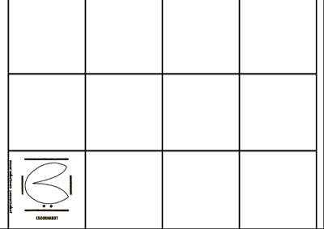  | [Plantilla cuadrados formato .SVG](https://drive.google.com/file/d/0B32DBGno8hnobk51LXhJUHp0Vlk/view) | [Plantilla cuadrados formato .PDF](https://drive.google.com/file/d/0B32DBGno8hnodjZWVXVJTGdiY0k/view)  
 | [Tablero folleto formato .SVG](https://drive.google.com/file/d/0B32DBGno8hnoeld1VlFjakIzUFE/view?usp=drive_web) | [Tablero folleto formato .PDF](https://drive.google.com/file/d/0B32DBGno8hnoM1pBOEhCa0lFTjg/view) 

## Tablero números

Puedes jugar tirando un dado y que busquen la casilla, realizando sumas simples... Edita el tablero para complicarlo.

Otro juego divertido son las carreras. Es para dos personas, cada uno con un escornabot y fuera del tablero. Se lanza un dado, como los números se repiten el objetivo es que alcancen la primera casilla que vean.

Tablero A-3         | Archivo SVG          | Archivo PDF         
------------- | ------------- | -------------   
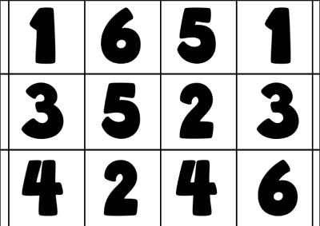 | [Tablero Números formato .SVG](https://drive.google.com/file/d/0B32DBGno8hnoTDlCNWl0N3ZRdGc/view) | [Tablero Números formato .PDF](https://drive.google.com/file/d/0B0UX14YozB7jTno0dTlkeHpnVVFTNGMzaFpuelZmNlhidkNF/view) 

## Tablero condicional

Se debe llegar desde la casilla inferior izquierda con el triángulo verde hasta la casilla inferior derecha cumpliendo las condiciones de las casillas. La casilla con el aspa roja no se puede pisar, del mismo modo que la azul ya que se caería al agua.

Tablero A-3         | Archivo SVG          | Archivo PDF         
------------- | ------------- | -------------   
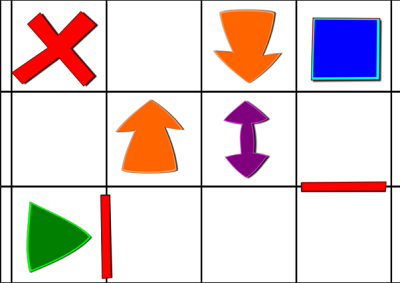 | [Tablero condicional formato .SVG](https://drive.google.com/file/d/0B32DBGno8hnocW1KQ2dnUHFKVzg/view) | [Tablero condicional formato .PDF](https://drive.google.com/file/d/0B32DBGno8hnoalZfUDlqZjEya1U/view)  

## Tablero figuras geométricas

Se pueden recortar las figuras interiores o cambiar de color para que l@s peques primero hagan la composición del tablero, luego juegan combinando colores y formas geométricas. Puedes crear dos dados, uno contiene colores y otro las formas geométricas.

Tablero A-3         | Archivo SVG          | Archivo PDF         
------------- | ------------- | -------------   
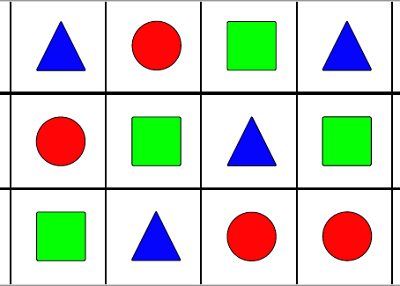  | [Tablero-Cuadrado-Triangulo-Circulo.svg](archivos/Tablero-Cuadrado-Triangulo-Circulo.svg) | [Tablero-Cuadrado-Triangulo-Circulo.pdf](archivos/Tablero-Cuadrado-Triangulo-Circulo.pdf)  

## Tableros alfabeto

Para trabajar las letras con animalicos :)

Tablero A-3         | Archivo SVG          | Archivo PDF         
------------- | ------------- | -------------   
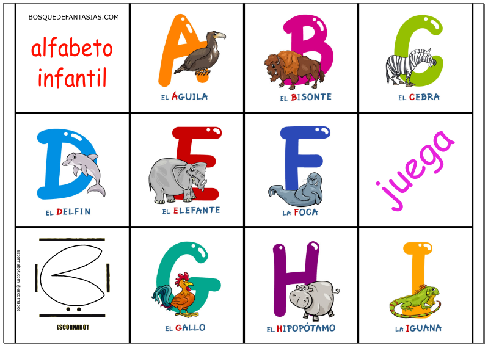  | [tablero-alfabeto-a-i.svg](archivos/tablero-alfabeto-a-i.svg) | [tablero-alfabeto-a-i.pdf](archivos/tablero-alfabeto-a-i.pdf)  
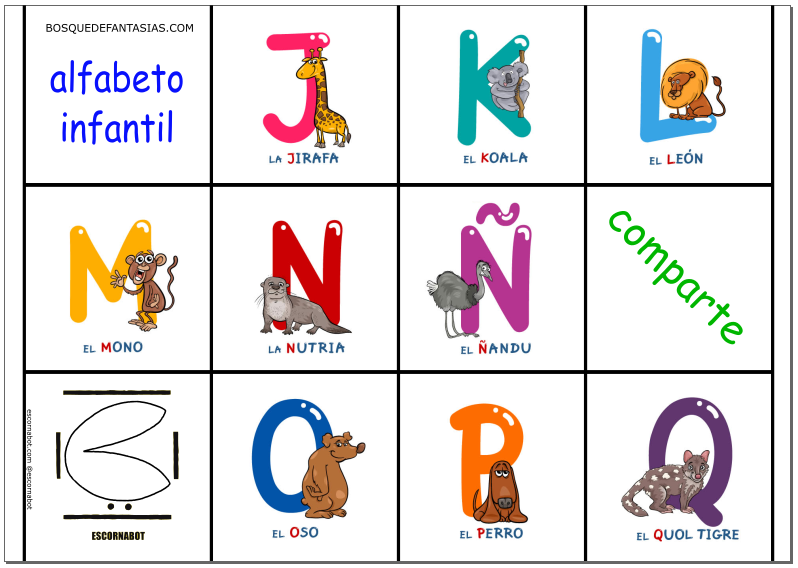  | [tablero-alfabeto-j-q.svg](archivos/tablero-alfabeto-j-q.svg) | [tablero-alfabeto-j-q.pdf](archivos/tablero-alfabeto-j-q.pdf)  
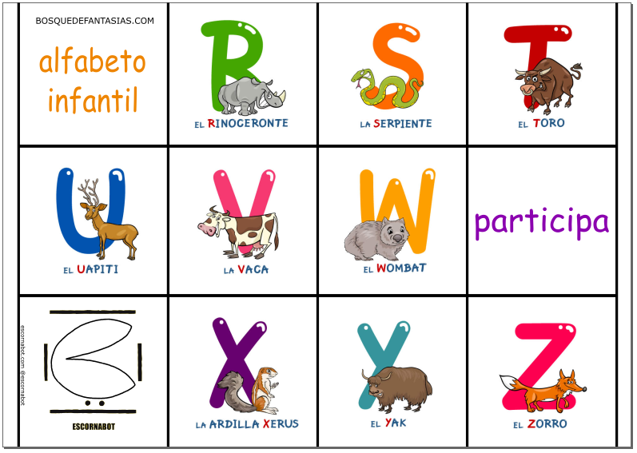  | [tablero-alfabeto-r-z.svg](archivos/tablero-alfabeto-r-z.svg) | [tablero-alfabeto-r-z.pdf](archivos/tablero-alfabeto-r-z.pdf)  

## Tablero triangular

Tablero A-3         | Archivo SVG          | Archivo PDF         
------------- | ------------- | -------------   
Para usar la plantilla triangular debes cambiar la programación para que los grados en los giros se adapten al dibujo, el robot debe ir por las líneas y llegar a los vértices de los triángulos

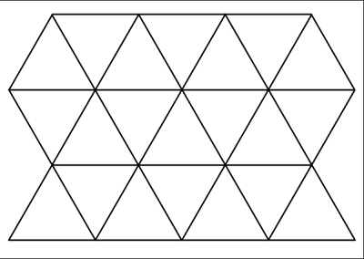  | [Plantilla triangular formato .SVG](https://drive.google.com/file/d/0B32DBGno8hnoSEkyN3VRM1I0Rmc/view) | [Plantilla triangular formato .PDF](https://drive.google.com/file/d/0B32DBGno8hnod1pXVzdfVG54VnM/view)  

## Tablero escritores gallegos
  
Tableros A-4         | Archivo SVG          | Archivo PDF         
------------- | ------------- | -------------       
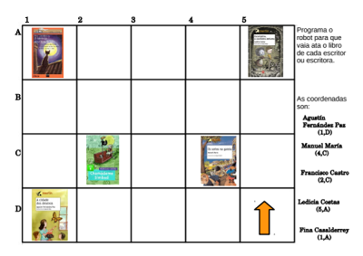 | | [Tablero escritores gallegos formato .PDF](https://drive.google.com/file/d/0B5m90BTAG1QYSExtNWdBNjVuU0E/view)  

## Tarjetas

Tarjeta         | Archivo            
------------- | -------------       
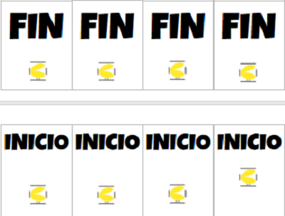 | [Tarjetas inicio-fin formato Word](https://docs.google.com/document/d/12gfkgnx5Rgb8NKzSXDHQ7-2KmUop8931cPN26ciuWcE/edit) 
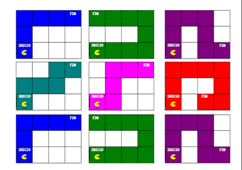 | [Tarjetas recorridos formato .PDF](https://drive.google.com/file/d/0B0UX14YozB7jTGZ3d1dYSGNsSkJZU0Fqd1BTMjJCMWdHVGRB/view) 
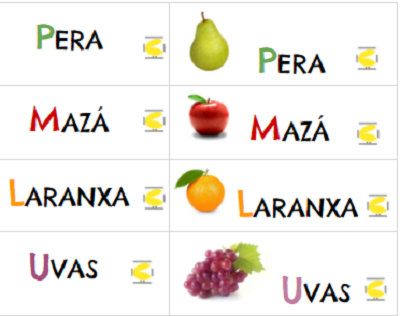 | [Tarjetas frutas formato Word](https://docs.google.com/document/d/1xnoPbf6wEXKz65S-1-KflOl4RJz2JpOLmkt9J7G1E6k/edit)  
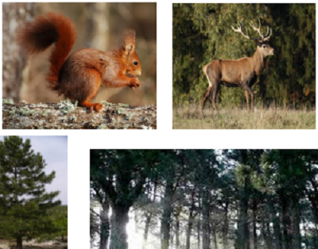 | [Tarjetas ecosistemas formato .PDF](http://escornabot.org/wiki/images/f/f7/Ecosistemas.pdf)
  
## Dados

[Cuerpos Geométricos para utilizar como dados](https://drive.google.com/file/d/0B0UX14YozB7jc0IyU1Rfb01kR3M/view)
